# 直流电机转速控制系统

- [一、设计目的、任务、要求、课题内容](#一设计目的任务要求课题内容)
  - [（一）课程设计任务](#一课程设计任务)
  - [（二）课程设计内容](#二课程设计内容)
  - [（三）主要仪器设备](#三主要仪器设备)
- [二、设计和实现](#二设计和实现)
  - [（一）建模仿真](#一建模仿真)
  - [（二）硬件设计](#二硬件设计)
  - [（三）单片机代码实现](#三单片机代码实现)
- [三、测试和结果](#三测试和结果)
  - [（一）不同参数下的系统输出变量变化曲线](#一不同参数下的系统输出变量变化曲线)
  - [（二）单片机功能实现](#二单片机功能实现)
    - [1. 转速设置与实时转速显示](#1-转速设置与实时转速显示)
    - [2. 当转速达到设定转速时，绿色LED灯常亮](#2-当转速达到设定转速时绿色led灯常亮)
    - [3. 异常报警](#3-异常报警)
  - [（三）电机动态特性分析](#三电机动态特性分析)
- [四、课题结果分析](#四课题结果分析)
- [五、课题中遇到的问题及实际心得](#五课题中遇到的问题及实际心得)
- [六、参考文献](#六参考文献)
- [附录](#附录)

## 一、设计目的、任务、要求、课题内容

### （一）课程设计任务

本课程设计直流电机调速控制系统，并进行仿真和实验验证。具体内容包括：

1. 建立直流电机的数学建模，设计转速反馈单闭环直流调速系统并进行仿真验证；
2. 设计系统硬件电路，完成硬件电路连接和测试；
3. 设计PID控制程序，实现电动机转速控制，给出不同参数下的系统输出变量变化曲线图，分析实验结果得出相关结论；
4. 实现下述功能：① 设置转速并实时显示当前转速；② 当转速达到设定转速时，绿色LED灯常亮；③当前转速与设定转速波动大于5%时，异常报警。
5. 分析系统在突然起动、突加负载、突减负载等条件下的电机动态特性。

### （二）课程设计内容

1. 被控对象数学建模和MATLAB仿真

    理解直流电动机的一般动态特性并建立数学模型，设计转速反馈单闭环直流调速系统并进行MATLAB仿真验证。

    重点支撑毕业要求指标点2-3、3-1。

2. 系统硬件电路设计、连接和测试

    完成单闭环直流调速系统的设计，包括系统方案的总体设计、硬件模块详细设计，并对硬件电路进行连接和测试。

    重点支撑毕业要求指标点2-3、3-1。

3. 软件设计

    完成单闭环直流调速系统的软件设计，包括转速检测模块、PWM驱动模块、PID控制模块等。

    重点支撑毕业要求指标点2-3、3-1。

4. 系统调试

    对转速控制进行调试，满足各项性能指标，使实验结果达到设计要求。

    重点支撑毕业要求指标点2-3、3-1。

5. 电机动态特性分析

    在突然启动、突加负载、突减负载条件下测量电动机的转速、电流，并分析直流调速系统的动态性能。

    重点支撑毕业要求指标点2-3，3-1。

6. 验收答辩

    现场验收答辩要点包括阐述设计思想、设计内容、调试过程、分析结果并回答问题。

### （三）主要仪器设备

**硬件**： 示波器、万用表、计算机、ARM开发平台、光电编码器、直流电机、电动机驱动模块、阻尼载荷等。

**软件**：MATLAB Sumlink、Visual Studio Code 代码编辑器、STM32CubeMX、MinGW、Arm GNU Toolchain 和 OpenOCD。

## 二、设计和实现

### （一）建模仿真

使用 MATLAB Simulink 对本课程设计所对应的比例积分控制的直流调速系统进行仿真：

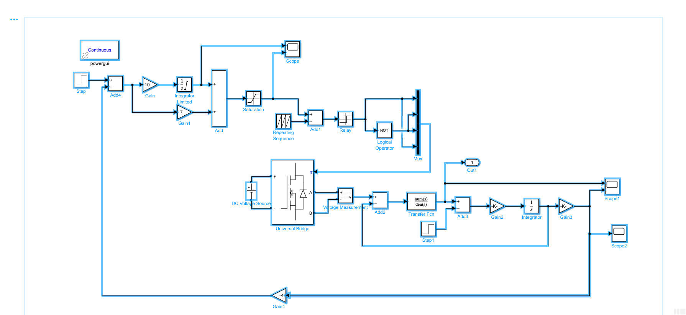

使用 PI 控制之后的效果：

示波器 Scope 的波形（黄色为积分单元的输出曲线，蓝色为 PI 调节后的输出曲线）

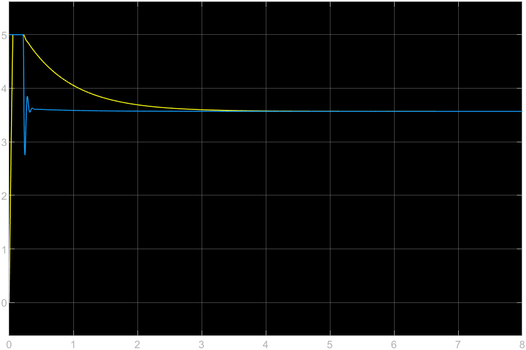

示波器 Scope1 的波形（黄色为输入电机的电流曲线，蓝色为输出转速曲线）

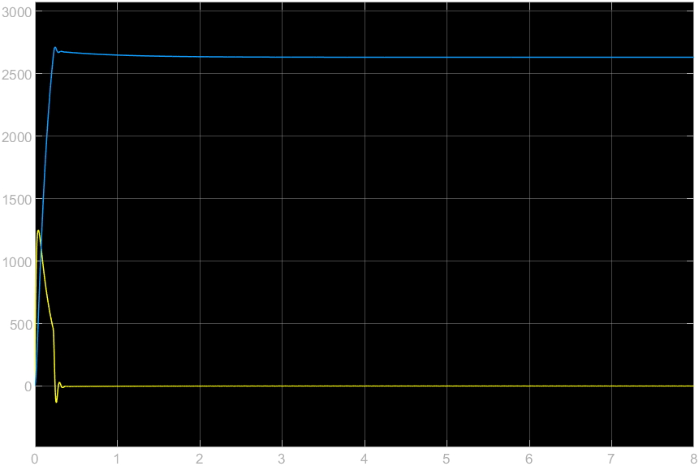

示波器 Scope1 的波形（黄色为输出转速曲线）

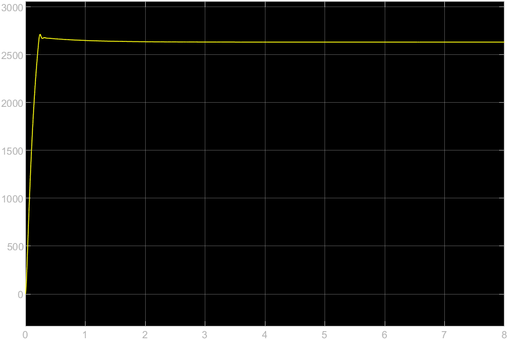

### （二）硬件设计

硬件部分主要由 STM32F401CDUx 核心板、底板、OLED 显示模块与直流减速电机组成。

底板以基于 ARM Cortex-M4F 为核心的 STM32F401 微控制器作为核心，工作频率高达 84 Mhz，具有浮点单元 FPU，DSP加速指令集。集成 UART、I2C、SPI、USB、I2S 等多种通信外设，同时片上集成速度高达 2.4 MSPS 的12位 ADC，可以满足高性能能控制系统的设计与实现。

同时底板还集成了温度测量单元，直流电机驱动，以及 Buck 单元，可以进行过程控制、运动控制等相关领域复杂工程的设计与验证。

其中直流电机部分用于设计以及验证运动控制系统，以及计算机控制理论，支持验证PID及其改进型等多种控制方法，电机集成正交编码器用于实现速度位置双闭环控制。使用 MATLAB 对实物建模后进行仿真，同时在实物验证运行。

Buck单元用于验证二阶系统的动态响应及其反馈控制器，可以验证PID算法以及超前-滞后补偿器（Lead-Lag Compensator）。使用 MATLAB 对实物建模后进行控制算法验证，同时在实物验证运行。

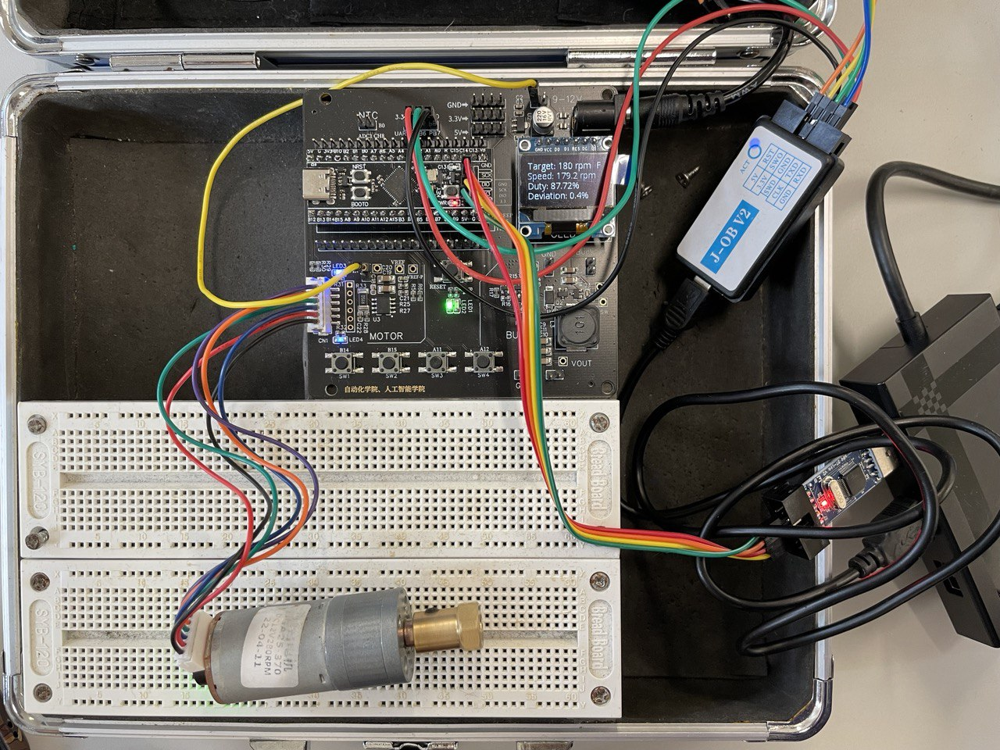

### （三）单片机代码实现

见附录

## 三、测试和结果

### （一）不同参数下的系统输出变量变化曲线

大略调整 PID 参数后的系统输出变量变化曲线

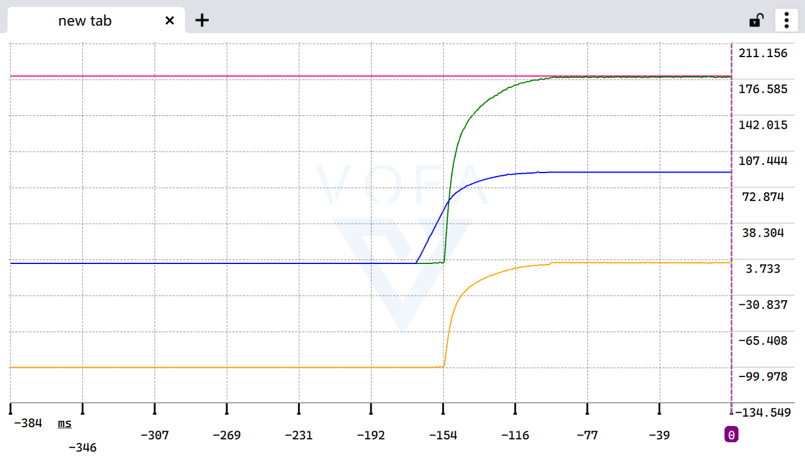

将 $K_p$ 参数提升为原来的 10 倍， $K_i$ 参数提高为原先的 2.5 倍后系统的输出变量变化曲线

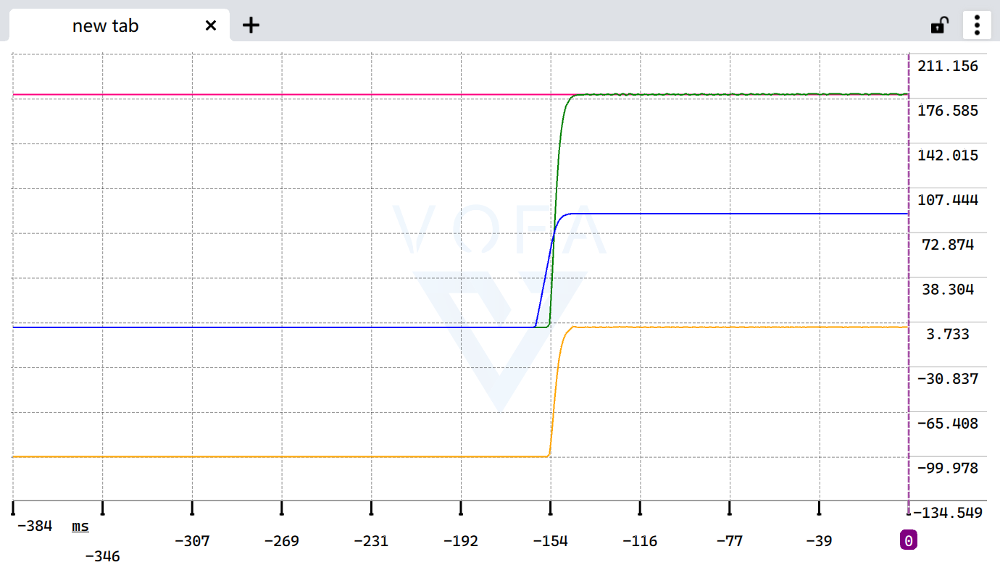

### （二）单片机功能实现

#### 1. 转速设置与实时转速显示

如下图所示，单片机成功实现了转速设置与实时转速显示功能。

第一行显示的是目标转速，F代表电动机现在正在正向运行；

第二行显示的是当前转速；

第三行显示的是输入电机的 PWM 波占空比；

第四行显示的是当前转速与目标转速间的误差值。

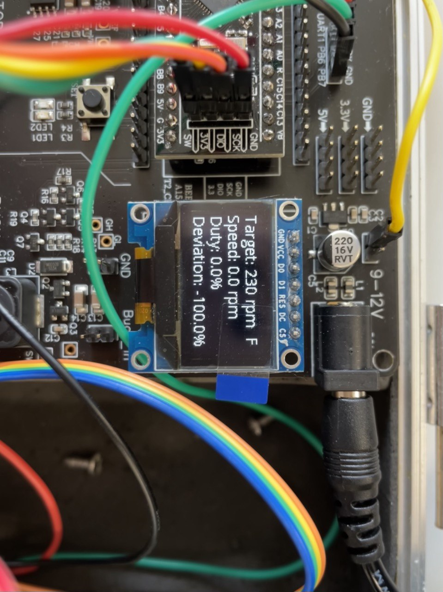

#### 2. 当转速达到设定转速时，绿色LED灯常亮

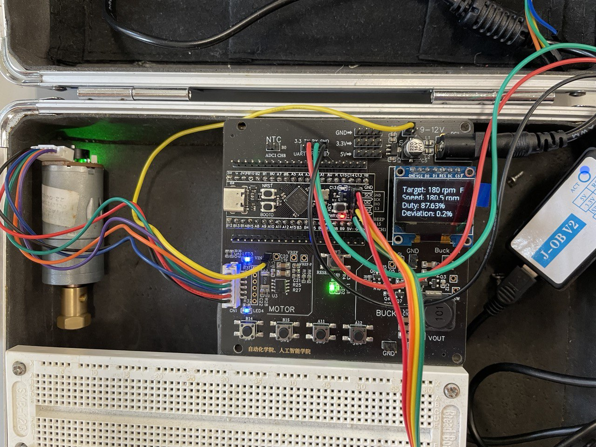

#### 3. 异常报警

当电机当前转速与目标转速间的误差值大于5%时，蜂鸣器会报警，绿色LED灯熄灭，红色LED灯亮起，系统异常报警。在施加一定阻尼或是电机突然启动的情况下，系统会短暂报警，但是很快控制住转速之后系统停止报警。

### （三）电机动态特性分析

在突然启动、突加负载、突减负载条件下测量电动机的转速、电流，并分析直流调速系统的动态性能。

初次启动（无累计误差/积分项值为0）电机

再次启动电机

电机加速

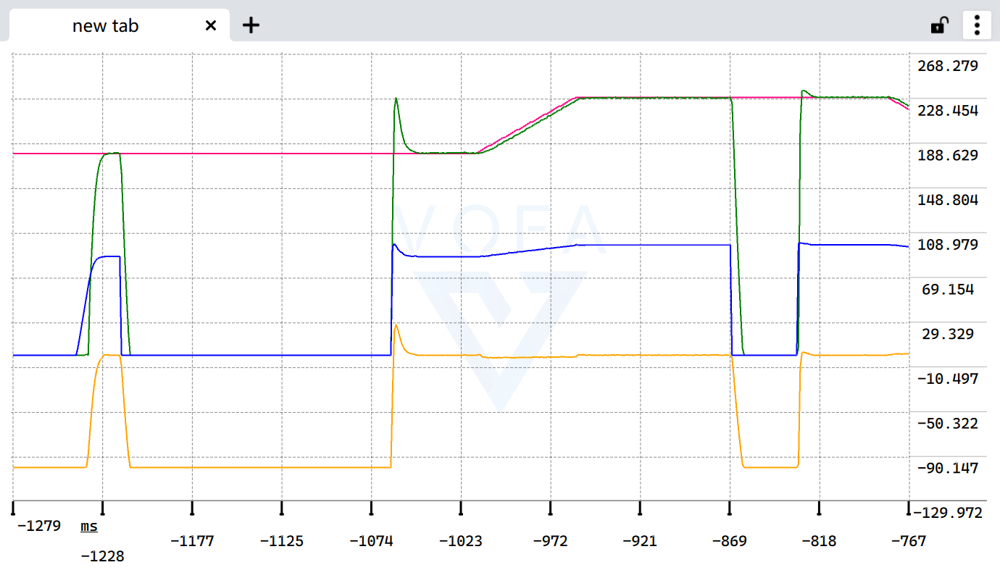

电机减速

电机低速运行

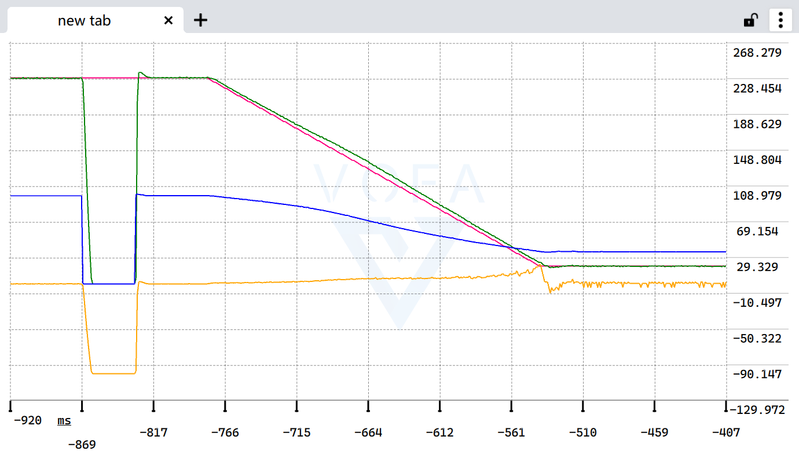

电机反转

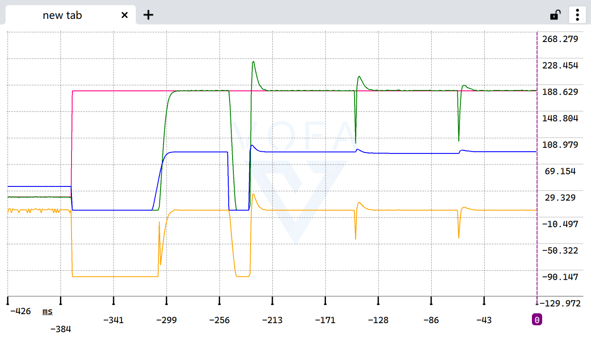

## 四、课题结果分析

该课程设计成功使用了单片机驱动了电机、LED、OLED 等硬件。实现了电机转速的实时 PID 控制，并且在 OLED 显示模块上成功将相关参数显示了出来。通过在电机的转速控制中加入转速闭环反馈环节，成功控制了电机的转速。并实现了自动报警功能，当转速误差较大时系统会自动报警。此外还基于 VOFA+ 串口调试软件，成功借助于 UART 将电机相关参数传输到上位机，并基于这些参数绘制了电机的目标转速、实际转速、占空比、误差值等参数的变化曲线。大大简化了 PID 参数的调试流程，从而实现了更好的控制效果。

## 五、课题中遇到的问题及实际心得

与传统的、课程设计参考资料所提供的开发环境不同，因为 Keil µVision 过于老旧且对开发的工具链约束较大，我并没有选择传统的 STM32CubeMX + Keil µVision + J-Link 进行项目开发。在本课程设计中，因为此前我深入接触过 Web 前端项目的开发，因此对于 Visual Studio Code 比较熟悉，因此选择了使用 STM32CubeMX + VSCode + 开源工具链 + ST-LINK + OpenOCD 的工具链进行项目的开发。

在工具链的环境配置上，因为我本身对于开发环境的配置比较熟悉，加之网络上的教程描述也较为详细，并没有花费过多的时间在环境的配置上。加之此前也在院科协接受过关于电赛嵌入式开发授课教学，在快速完成了开发编程环境的配置后，即使我本身对于 STM32CubeMX 并不是很熟悉，前期依照课程设计参考资料步骤开发的过程也还是较为顺利的。

但是在项目中引入不受 STM32CubeMX 管理的 u8g2 OLED 显示屏驱动源码文件后，遇到了不小的问题，因为我的交叉编译环境依赖于 Makefile 对源码进行编译，但是我本身并没有什么嵌入式 C 语言开发的经验，对 Makefile 并不是很熟悉，只了解过这是一个类似于 Python 与 Node.js 等语言的项目依赖管理方式，导致我迟迟没能在编译中正确引入头文件与 C 源码依赖文件，使得编译完全无法通过。

但在快速的学习与了解 Makefile 文件并广泛搜索网络上相关问题的解决方案后，通过手动逐一指定 C 源码文件位置，这一问题得到了充分的解决，我也成功点亮了 OLED 屏幕。

此后我还遇到了转速计数圈数与实际不符的情况，我虽然在第一时间定位到了代码中存在问题的逻辑部分，确定了是时钟频率的问题，但是因为对于 STM32CubeMX 并不熟悉，只知道内置晶振频率是 84 MHz，是符合我的需求的，并不清楚经过分频等操作后实际的系统时钟频率为多少。在上网学习与了解了相关知识后，我成功在 STM32CubeMX 的时钟界面将 ABP 总线时钟设置为了我所需要的 84 MHz，成功解决了问题。

后续在项目开发接近尾声，在对 PID 曲线进行调整的时候，我发现在我将目标转速设定为最高时，PID 控制下的实际转速变化曲线出现了积分饱和的现象，在电机突然启动时， PID 算法输出的占空比的值会直接飙升到 100% 以上，这显然是无法达到的，但又因为此时误差值过小，PID 算法用了很长时间才纠正了占空比的输出值，使其从 100% 逐渐降为了电机稳定运行所需的 98/99%。我通过网络搜索了解到了使用积分遇限削弱法抗积分饱和，通过在我的代码中添加相关实现，很好的改善了此种情况下电机突然启动的电机转速曲线。

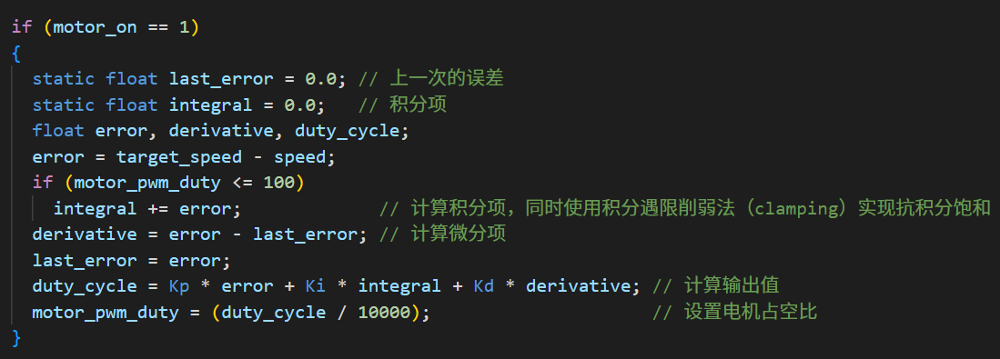

总而言之，初次接触 STM32 与 STM32CubeMX 的开发与配置，对我来说确实是一个全新的领域，参考资料中的很多内容对小白而言也并不是很友好。但是在逐渐上手熟练开发流程之后，我觉得开发难度也并没有原先所认为的那么大，STM32CubeMX 也是一个很全能的软件，在熟悉命令行与开发环境配置的情况下配合输出 Makefile 可以很完美的取代 Keil 进行工程项目的开发、编译与下载，相较于使用 Keil，这样开发项目不仅相比 Keil 要更为轻量化，自己组织的工具链也更为灵活，可以更自由的组织、搭配、改动自己的工具链以适应将来更多元化类型的嵌入式硬件开发的需要。我在这次的课程设计项目开发的过程中可以说是学习良多。

## 六、参考文献

[1] 阮毅，陈伯时. 电力拖动自动控制系统[M]. 机械工业出版社，2015年
[2] 顾亦然，张腾飞等. 嵌入式系统及应用[M]. 南京邮电大学，2009年
[3] 廖义奎. Cortex-M3之STM32嵌入式系统设计[M]. 中国电力出版社，2012年
[4] 刘景林，罗玲，付朝阳. 电机及拖动基础[M]. 化学工业出版社，2011年
[5] 中国国家标准化管理委员会. 直流电机试验方法[M]. 中国标准出版社，2009年
[6] 丁文龙. ARM 嵌入式系统基础与开发教程[M]. 北京大学出版社，2010年

## 附录

单片机代码实现

```c
/* USER CODE BEGIN Header */
/**
 ******************************************************************************
 * @file           : main.c
 * @brief          : Main program body
 ******************************************************************************
 * @attention
 *
 * Copyright (c) 2023 STMicroelectronics.
 * All rights reserved.
 *
 * This software is licensed under terms that can be found in the LICENSE file
 * in the root directory of this software component.
 * If no LICENSE file comes with this software, it is provided AS-IS.
 *
 ******************************************************************************
 */
/* USER CODE END Header */
/* Includes ------------------------------------------------------------------*/
#include "main.h"

/* Private includes ----------------------------------------------------------*/
/* USER CODE BEGIN Includes */
#include "u8g2.h"
#include <stdio.h>
#include <stdlib.h>
#include <stdarg.h>
#include <math.h>
/* USER CODE END Includes */

/* Private typedef -----------------------------------------------------------*/
/* USER CODE BEGIN PTD */

/* USER CODE END PTD */

/* Private define ------------------------------------------------------------*/
/* USER CODE BEGIN PD */

/* USER CODE END PD */

/* Private macro -------------------------------------------------------------*/
/* USER CODE BEGIN PM */
#define ADC_ARRAY_NUM (1024)
#define Kp 5
#define Ki 0.05
#define Kd 2
// #define Kd 0
/* USER CODE END PM */

/* Private variables ---------------------------------------------------------*/
SPI_HandleTypeDef hspi1;

TIM_HandleTypeDef htim1;
TIM_HandleTypeDef htim2;
TIM_HandleTypeDef htim5;
TIM_HandleTypeDef htim10;

UART_HandleTypeDef huart1;

/* USER CODE BEGIN PV */
u8g2_t u8g2;
uint16_t adcvalue = 0;
uint16_t adcarray[ADC_ARRAY_NUM];
uint32_t motor_on = 0;
uint32_t motor_forward = 1;
uint32_t motor_pwm_freq = 84;
uint32_t beep_freq = 2700;
uint32_t beep_on = 0;
uint32_t key_1_tick = 0;
uint32_t key_2_tick = 0;
uint32_t key_3_tick = 0;
uint32_t key_4_tick = 0;

float speed = 0;
int target_speed = 180;
float motor_pwm_duty = 0;
float deviate = 0;
/* USER CODE END PV */

/* Private function prototypes -----------------------------------------------*/
void SystemClock_Config(void);
static void MX_GPIO_Init(void);
static void MX_TIM1_Init(void);
static void MX_TIM2_Init(void);
static void MX_SPI1_Init(void);
static void MX_USART1_UART_Init(void);
static void MX_TIM5_Init(void);
static void MX_TIM10_Init(void);
/* USER CODE BEGIN PFP */
int UART_printf(UART_HandleTypeDef *huart, const char *fmt, ...);

int u8g2_printf(u8g2_t *u8g2, u8g2_uint_t x, u8g2_uint_t y, const char *fmt,
                ...);
uint8_t u8x8_stm32_gpio_and_delay(U8X8_UNUSED u8x8_t *u8x8,
                                  U8X8_UNUSED uint8_t msg,
                                  U8X8_UNUSED uint8_t arg_int,
                                  U8X8_UNUSED void *arg_ptr);
uint8_t u8x8_byte_4wire_hw_spi(u8x8_t *u8x8, uint8_t msg, uint8_t arg_int, void *arg_ptr);
/* USER CODE END PFP */

/* Private user code ---------------------------------------------------------*/
/* USER CODE BEGIN 0 */

/* USER CODE END 0 */

/**
 * @brief  The application entry point.
 * @retval int
 */
int main(void)
{
  /* USER CODE BEGIN 1 */

  /* USER CODE END 1 */

  /* MCU Configuration--------------------------------------------------------*/

  /* Reset of all peripherals, Initializes the Flash interface and the Systick. */
  HAL_Init();

  /* USER CODE BEGIN Init */

  /* USER CODE END Init */

  /* Configure the system clock */
  SystemClock_Config();

  /* USER CODE BEGIN SysInit */

  /* USER CODE END SysInit */

  /* Initialize all configured peripherals */
  MX_GPIO_Init();
  MX_TIM1_Init();
  MX_TIM2_Init();
  MX_SPI1_Init();
  MX_USART1_UART_Init();
  MX_TIM5_Init();
  MX_TIM10_Init();
  /* USER CODE BEGIN 2 */

  /* USER CODE END 2 */

  /* Infinite loop */
  /* USER CODE BEGIN WHILE */
  u8g2_Setup_ssd1306_128x64_noname_2(&u8g2, U8G2_R0, u8x8_byte_4wire_hw_spi, u8x8_stm32_gpio_and_delay); // init u8g2 structure
  u8g2_InitDisplay(&u8g2);                                                                               // send init sequence to the display, display is in sleep mode after this,
  u8g2_SetPowerSave(&u8g2, 0);                                                                           // wake up display

  HAL_TIM_Encoder_Start(&htim5, TIM_CHANNEL_1);
  HAL_TIM_Encoder_Start(&htim5, TIM_CHANNEL_2);

  UART_printf(&huart1, "These messages are sent by UART_printf!\r\n");
  UART_printf(&huart1, "Build on "__TIME__
                       " "__DATE__
                       " \r\n");

  HAL_TIM_Base_Start_IT(&htim10);

  HAL_TIM_PWM_Start(&htim2, TIM_CHANNEL_1);
  HAL_TIM_PWM_Start(&htim1, TIM_CHANNEL_2);
  HAL_TIM_PWM_Start(&htim1, TIM_CHANNEL_3);

  while (1)
  {
    if ((fabs(deviate) - 5) >= 0 && motor_on)
    {
      beep_on = 1;
      HAL_GPIO_WritePin(LED_R_GPIO_Port, LED_R_Pin, GPIO_PIN_SET);
      HAL_GPIO_WritePin(LED_G_GPIO_Port, LED_G_Pin, GPIO_PIN_RESET);
    }
    else if (motor_on)
    {
      beep_on = 0;
      HAL_GPIO_WritePin(LED_G_GPIO_Port, LED_G_Pin, GPIO_PIN_SET);
      HAL_GPIO_WritePin(LED_R_GPIO_Port, LED_R_Pin, GPIO_PIN_RESET);
    }
    else
    {
      beep_on = 0;
      HAL_GPIO_WritePin(LED_G_GPIO_Port, LED_G_Pin, GPIO_PIN_RESET);
      HAL_GPIO_WritePin(LED_R_GPIO_Port, LED_R_Pin, GPIO_PIN_RESET);
    }

    if (HAL_GPIO_ReadPin(KEY_1_GPIO_Port, KEY_1_Pin) == GPIO_PIN_RESET)
    {
      if ((HAL_GetTick() - key_1_tick) > 100)
      {
        motor_on = motor_on == 1 ? 0 : 1;
        motor_pwm_duty = motor_on == 1 ? motor_pwm_duty : 0;
      }
      // Record the last detection tick
      key_1_tick = HAL_GetTick();
    }

    if (HAL_GPIO_ReadPin(KEY_2_GPIO_Port, KEY_2_Pin) == GPIO_PIN_RESET)
    {
      if ((HAL_GetTick() - key_2_tick) > 100)
      {
        motor_forward = (motor_forward == 0) ? 1 : 0;
      }
      // Record the last detection tick
      key_2_tick = HAL_GetTick();
    }

    if (HAL_GPIO_ReadPin(KEY_3_GPIO_Port, KEY_3_Pin) == GPIO_PIN_RESET)
    {
      if ((HAL_GetTick() - key_3_tick) > 100)
      {
        // beep_on = (beep_on == 0) ? 1 : 0;
        if (target_speed > 20)
          target_speed -= 1;
        // Record the last detection tick
        key_3_tick = HAL_GetTick();
      }
    }

    if (HAL_GPIO_ReadPin(KEY_4_GPIO_Port, KEY_4_Pin) == GPIO_PIN_RESET)
    {
      if ((HAL_GetTick() - key_4_tick) > 100)
      {
        if (target_speed < 230)
          target_speed += 1;
        // Record the last detection tick
        key_4_tick = HAL_GetTick();
      }
    }

    if (motor_on == 1)
    {
      static float last_error = 0.0; // 上一次的误差
      static float integral = 0.0;   // 积分项
      float error, derivative, duty_cycle;
      error = target_speed - speed;
      if (motor_pwm_duty <= 100)
        integral += error;             // 计算积分项，同时使用积分遇限削弱法（clamping）实现抗积分饱和
      derivative = error - last_error; // 计算微分项
      last_error = error;
      duty_cycle = Kp * error + Ki * integral + Kd * derivative; // 计算输出值
      motor_pwm_duty = (duty_cycle / 10000);                     // 设置电机占空比
    }

    __HAL_TIM_SetAutoreload(&htim1, ((84000000ul / motor_pwm_freq) - 1)); /* 84MHz/motor_pwm_freq is the motor pwm sampling frequency */
    uint32_t compare1 = __HAL_TIM_GetAutoreload(&htim1);
    if (motor_forward)
    {
      __HAL_TIM_SetCompare(&htim1, TIM_CHANNEL_2, (uint32_t)(compare1 * (motor_pwm_duty / 100.0f)));
      __HAL_TIM_SetCompare(&htim1, TIM_CHANNEL_3, (uint32_t)compare1 * 0);
    }
    else
    {
      __HAL_TIM_SetCompare(&htim1, TIM_CHANNEL_3, (uint32_t)(compare1 * (motor_pwm_duty / 100.0f)));
      __HAL_TIM_SetCompare(&htim1, TIM_CHANNEL_2, (uint32_t)compare1 * 0);
    }

    __HAL_TIM_SetAutoreload(&htim2, ((84000000ul / beep_freq) - 1));
    uint32_t compare2 = __HAL_TIM_GetAutoreload(&htim2);
    if (beep_on)
      __HAL_TIM_SetCompare(&htim2, TIM_CHANNEL_1, (uint32_t)compare2 / 2);
    else
      __HAL_TIM_SetCompare(&htim2, TIM_CHANNEL_1, (uint32_t)compare2 * 0);
    /* USER CODE END WHILE */

    /* USER CODE BEGIN 3 */
  }
  /* USER CODE END 3 */
}

/**
 * @brief System Clock Configuration
 * @retval None
 */
void SystemClock_Config(void)
{
  RCC_OscInitTypeDef RCC_OscInitStruct = {0};
  RCC_ClkInitTypeDef RCC_ClkInitStruct = {0};

  /** Configure the main internal regulator output voltage
   */
  __HAL_RCC_PWR_CLK_ENABLE();
  __HAL_PWR_VOLTAGESCALING_CONFIG(PWR_REGULATOR_VOLTAGE_SCALE2);

  /** Initializes the RCC Oscillators according to the specified parameters
   * in the RCC_OscInitTypeDef structure.
   */
  RCC_OscInitStruct.OscillatorType = RCC_OSCILLATORTYPE_HSI;
  RCC_OscInitStruct.HSIState = RCC_HSI_ON;
  RCC_OscInitStruct.HSICalibrationValue = RCC_HSICALIBRATION_DEFAULT;
  RCC_OscInitStruct.PLL.PLLState = RCC_PLL_ON;
  RCC_OscInitStruct.PLL.PLLSource = RCC_PLLSOURCE_HSI;
  RCC_OscInitStruct.PLL.PLLM = 8;
  RCC_OscInitStruct.PLL.PLLN = 84;
  RCC_OscInitStruct.PLL.PLLP = RCC_PLLP_DIV2;
  RCC_OscInitStruct.PLL.PLLQ = 4;
  if (HAL_RCC_OscConfig(&RCC_OscInitStruct) != HAL_OK)
  {
    Error_Handler();
  }

  /** Initializes the CPU, AHB and APB buses clocks
   */
  RCC_ClkInitStruct.ClockType = RCC_CLOCKTYPE_HCLK | RCC_CLOCKTYPE_SYSCLK | RCC_CLOCKTYPE_PCLK1 | RCC_CLOCKTYPE_PCLK2;
  RCC_ClkInitStruct.SYSCLKSource = RCC_SYSCLKSOURCE_PLLCLK;
  RCC_ClkInitStruct.AHBCLKDivider = RCC_SYSCLK_DIV1;
  RCC_ClkInitStruct.APB1CLKDivider = RCC_HCLK_DIV2;
  RCC_ClkInitStruct.APB2CLKDivider = RCC_HCLK_DIV1;

  if (HAL_RCC_ClockConfig(&RCC_ClkInitStruct, FLASH_LATENCY_2) != HAL_OK)
  {
    Error_Handler();
  }
}

/**
 * @brief SPI1 Initialization Function
 * @param None
 * @retval None
 */
static void MX_SPI1_Init(void)
{

  /* USER CODE BEGIN SPI1_Init 0 */

  /* USER CODE END SPI1_Init 0 */

  /* USER CODE BEGIN SPI1_Init 1 */

  /* USER CODE END SPI1_Init 1 */
  /* SPI1 parameter configuration*/
  hspi1.Instance = SPI1;
  hspi1.Init.Mode = SPI_MODE_MASTER;
  hspi1.Init.Direction = SPI_DIRECTION_2LINES;
  hspi1.Init.DataSize = SPI_DATASIZE_8BIT;
  hspi1.Init.CLKPolarity = SPI_POLARITY_HIGH;
  hspi1.Init.CLKPhase = SPI_PHASE_2EDGE;
  hspi1.Init.NSS = SPI_NSS_SOFT;
  hspi1.Init.BaudRatePrescaler = SPI_BAUDRATEPRESCALER_4;
  hspi1.Init.FirstBit = SPI_FIRSTBIT_MSB;
  hspi1.Init.TIMode = SPI_TIMODE_DISABLE;
  hspi1.Init.CRCCalculation = SPI_CRCCALCULATION_DISABLE;
  hspi1.Init.CRCPolynomial = 10;
  if (HAL_SPI_Init(&hspi1) != HAL_OK)
  {
    Error_Handler();
  }
  /* USER CODE BEGIN SPI1_Init 2 */

  /* USER CODE END SPI1_Init 2 */
}

/**
 * @brief TIM1 Initialization Function
 * @param None
 * @retval None
 */
static void MX_TIM1_Init(void)
{

  /* USER CODE BEGIN TIM1_Init 0 */

  /* USER CODE END TIM1_Init 0 */

  TIM_ClockConfigTypeDef sClockSourceConfig = {0};
  TIM_MasterConfigTypeDef sMasterConfig = {0};
  TIM_OC_InitTypeDef sConfigOC = {0};
  TIM_BreakDeadTimeConfigTypeDef sBreakDeadTimeConfig = {0};

  /* USER CODE BEGIN TIM1_Init 1 */

  /* USER CODE END TIM1_Init 1 */
  htim1.Instance = TIM1;
  htim1.Init.Prescaler = 0;
  htim1.Init.CounterMode = TIM_COUNTERMODE_UP;
  htim1.Init.Period = 65535;
  htim1.Init.ClockDivision = TIM_CLOCKDIVISION_DIV1;
  htim1.Init.RepetitionCounter = 0;
  htim1.Init.AutoReloadPreload = TIM_AUTORELOAD_PRELOAD_DISABLE;
  if (HAL_TIM_Base_Init(&htim1) != HAL_OK)
  {
    Error_Handler();
  }
  sClockSourceConfig.ClockSource = TIM_CLOCKSOURCE_INTERNAL;
  if (HAL_TIM_ConfigClockSource(&htim1, &sClockSourceConfig) != HAL_OK)
  {
    Error_Handler();
  }
  if (HAL_TIM_PWM_Init(&htim1) != HAL_OK)
  {
    Error_Handler();
  }
  sMasterConfig.MasterOutputTrigger = TIM_TRGO_RESET;
  sMasterConfig.MasterSlaveMode = TIM_MASTERSLAVEMODE_DISABLE;
  if (HAL_TIMEx_MasterConfigSynchronization(&htim1, &sMasterConfig) != HAL_OK)
  {
    Error_Handler();
  }
  sConfigOC.OCMode = TIM_OCMODE_PWM1;
  sConfigOC.Pulse = 0;
  sConfigOC.OCPolarity = TIM_OCPOLARITY_HIGH;
  sConfigOC.OCNPolarity = TIM_OCNPOLARITY_HIGH;
  sConfigOC.OCFastMode = TIM_OCFAST_DISABLE;
  sConfigOC.OCIdleState = TIM_OCIDLESTATE_RESET;
  sConfigOC.OCNIdleState = TIM_OCNIDLESTATE_RESET;
  if (HAL_TIM_PWM_ConfigChannel(&htim1, &sConfigOC, TIM_CHANNEL_2) != HAL_OK)
  {
    Error_Handler();
  }
  if (HAL_TIM_PWM_ConfigChannel(&htim1, &sConfigOC, TIM_CHANNEL_3) != HAL_OK)
  {
    Error_Handler();
  }
  sBreakDeadTimeConfig.OffStateRunMode = TIM_OSSR_DISABLE;
  sBreakDeadTimeConfig.OffStateIDLEMode = TIM_OSSI_DISABLE;
  sBreakDeadTimeConfig.LockLevel = TIM_LOCKLEVEL_OFF;
  sBreakDeadTimeConfig.DeadTime = 0;
  sBreakDeadTimeConfig.BreakState = TIM_BREAK_DISABLE;
  sBreakDeadTimeConfig.BreakPolarity = TIM_BREAKPOLARITY_HIGH;
  sBreakDeadTimeConfig.AutomaticOutput = TIM_AUTOMATICOUTPUT_DISABLE;
  if (HAL_TIMEx_ConfigBreakDeadTime(&htim1, &sBreakDeadTimeConfig) != HAL_OK)
  {
    Error_Handler();
  }
  /* USER CODE BEGIN TIM1_Init 2 */

  /* USER CODE END TIM1_Init 2 */
  HAL_TIM_MspPostInit(&htim1);
}

/**
 * @brief TIM2 Initialization Function
 * @param None
 * @retval None
 */
static void MX_TIM2_Init(void)
{

  /* USER CODE BEGIN TIM2_Init 0 */

  /* USER CODE END TIM2_Init 0 */

  TIM_ClockConfigTypeDef sClockSourceConfig = {0};
  TIM_MasterConfigTypeDef sMasterConfig = {0};
  TIM_OC_InitTypeDef sConfigOC = {0};

  /* USER CODE BEGIN TIM2_Init 1 */

  /* USER CODE END TIM2_Init 1 */
  htim2.Instance = TIM2;
  htim2.Init.Prescaler = 0;
  htim2.Init.CounterMode = TIM_COUNTERMODE_UP;
  htim2.Init.Period = 4294967295;
  htim2.Init.ClockDivision = TIM_CLOCKDIVISION_DIV1;
  htim2.Init.AutoReloadPreload = TIM_AUTORELOAD_PRELOAD_DISABLE;
  if (HAL_TIM_Base_Init(&htim2) != HAL_OK)
  {
    Error_Handler();
  }
  sClockSourceConfig.ClockSource = TIM_CLOCKSOURCE_INTERNAL;
  if (HAL_TIM_ConfigClockSource(&htim2, &sClockSourceConfig) != HAL_OK)
  {
    Error_Handler();
  }
  if (HAL_TIM_PWM_Init(&htim2) != HAL_OK)
  {
    Error_Handler();
  }
  sMasterConfig.MasterOutputTrigger = TIM_TRGO_RESET;
  sMasterConfig.MasterSlaveMode = TIM_MASTERSLAVEMODE_DISABLE;
  if (HAL_TIMEx_MasterConfigSynchronization(&htim2, &sMasterConfig) != HAL_OK)
  {
    Error_Handler();
  }
  sConfigOC.OCMode = TIM_OCMODE_PWM1;
  sConfigOC.Pulse = 0;
  sConfigOC.OCPolarity = TIM_OCPOLARITY_HIGH;
  sConfigOC.OCFastMode = TIM_OCFAST_DISABLE;
  if (HAL_TIM_PWM_ConfigChannel(&htim2, &sConfigOC, TIM_CHANNEL_1) != HAL_OK)
  {
    Error_Handler();
  }
  /* USER CODE BEGIN TIM2_Init 2 */

  /* USER CODE END TIM2_Init 2 */
  HAL_TIM_MspPostInit(&htim2);
}

/**
 * @brief TIM5 Initialization Function
 * @param None
 * @retval None
 */
static void MX_TIM5_Init(void)
{

  /* USER CODE BEGIN TIM5_Init 0 */

  /* USER CODE END TIM5_Init 0 */

  TIM_Encoder_InitTypeDef sConfig = {0};
  TIM_MasterConfigTypeDef sMasterConfig = {0};

  /* USER CODE BEGIN TIM5_Init 1 */

  /* USER CODE END TIM5_Init 1 */
  htim5.Instance = TIM5;
  htim5.Init.Prescaler = 0;
  htim5.Init.CounterMode = TIM_COUNTERMODE_UP;
  htim5.Init.Period = 4294967295;
  htim5.Init.ClockDivision = TIM_CLOCKDIVISION_DIV1;
  htim5.Init.AutoReloadPreload = TIM_AUTORELOAD_PRELOAD_DISABLE;
  sConfig.EncoderMode = TIM_ENCODERMODE_TI12;
  sConfig.IC1Polarity = TIM_ICPOLARITY_RISING;
  sConfig.IC1Selection = TIM_ICSELECTION_DIRECTTI;
  sConfig.IC1Prescaler = TIM_ICPSC_DIV1;
  sConfig.IC1Filter = 0;
  sConfig.IC2Polarity = TIM_ICPOLARITY_RISING;
  sConfig.IC2Selection = TIM_ICSELECTION_DIRECTTI;
  sConfig.IC2Prescaler = TIM_ICPSC_DIV1;
  sConfig.IC2Filter = 0;
  if (HAL_TIM_Encoder_Init(&htim5, &sConfig) != HAL_OK)
  {
    Error_Handler();
  }
  sMasterConfig.MasterOutputTrigger = TIM_TRGO_RESET;
  sMasterConfig.MasterSlaveMode = TIM_MASTERSLAVEMODE_DISABLE;
  if (HAL_TIMEx_MasterConfigSynchronization(&htim5, &sMasterConfig) != HAL_OK)
  {
    Error_Handler();
  }
  /* USER CODE BEGIN TIM5_Init 2 */

  /* USER CODE END TIM5_Init 2 */
}

/**
 * @brief TIM10 Initialization Function
 * @param None
 * @retval None
 */
static void MX_TIM10_Init(void)
{

  /* USER CODE BEGIN TIM10_Init 0 */

  /* USER CODE END TIM10_Init 0 */

  /* USER CODE BEGIN TIM10_Init 1 */

  /* USER CODE END TIM10_Init 1 */
  htim10.Instance = TIM10;
  htim10.Init.Prescaler = 83;
  htim10.Init.CounterMode = TIM_COUNTERMODE_UP;
  htim10.Init.Period = 9999;
  htim10.Init.ClockDivision = TIM_CLOCKDIVISION_DIV1;
  htim10.Init.AutoReloadPreload = TIM_AUTORELOAD_PRELOAD_DISABLE;
  if (HAL_TIM_Base_Init(&htim10) != HAL_OK)
  {
    Error_Handler();
  }
  /* USER CODE BEGIN TIM10_Init 2 */

  /* USER CODE END TIM10_Init 2 */
}

/**
 * @brief USART1 Initialization Function
 * @param None
 * @retval None
 */
static void MX_USART1_UART_Init(void)
{

  /* USER CODE BEGIN USART1_Init 0 */

  /* USER CODE END USART1_Init 0 */

  /* USER CODE BEGIN USART1_Init 1 */

  /* USER CODE END USART1_Init 1 */
  huart1.Instance = USART1;
  huart1.Init.BaudRate = 115200;
  huart1.Init.WordLength = UART_WORDLENGTH_8B;
  huart1.Init.StopBits = UART_STOPBITS_1;
  huart1.Init.Parity = UART_PARITY_NONE;
  huart1.Init.Mode = UART_MODE_TX_RX;
  huart1.Init.HwFlowCtl = UART_HWCONTROL_NONE;
  huart1.Init.OverSampling = UART_OVERSAMPLING_16;
  if (HAL_UART_Init(&huart1) != HAL_OK)
  {
    Error_Handler();
  }
  /* USER CODE BEGIN USART1_Init 2 */

  /* USER CODE END USART1_Init 2 */
}

/**
 * @brief GPIO Initialization Function
 * @param None
 * @retval None
 */
static void MX_GPIO_Init(void)
{
  GPIO_InitTypeDef GPIO_InitStruct = {0};
  /* USER CODE BEGIN MX_GPIO_Init_1 */
  /* USER CODE END MX_GPIO_Init_1 */

  /* GPIO Ports Clock Enable */
  __HAL_RCC_GPIOA_CLK_ENABLE();
  __HAL_RCC_GPIOB_CLK_ENABLE();

  /*Configure GPIO pin Output Level */
  HAL_GPIO_WritePin(OLED_CS_GPIO_Port, OLED_CS_Pin, GPIO_PIN_RESET);

  /*Configure GPIO pin Output Level */
  HAL_GPIO_WritePin(GPIOB, OLED_RST_Pin | OLED_DC_Pin | LED_G_Pin | LED_R_Pin, GPIO_PIN_RESET);

  /*Configure GPIO pin : OLED_CS_Pin */
  GPIO_InitStruct.Pin = OLED_CS_Pin;
  GPIO_InitStruct.Mode = GPIO_MODE_OUTPUT_PP;
  GPIO_InitStruct.Pull = GPIO_NOPULL;
  GPIO_InitStruct.Speed = GPIO_SPEED_FREQ_LOW;
  HAL_GPIO_Init(OLED_CS_GPIO_Port, &GPIO_InitStruct);

  /*Configure GPIO pins : OLED_RST_Pin OLED_DC_Pin LED_G_Pin LED_R_Pin */
  GPIO_InitStruct.Pin = OLED_RST_Pin | OLED_DC_Pin | LED_G_Pin | LED_R_Pin;
  GPIO_InitStruct.Mode = GPIO_MODE_OUTPUT_PP;
  GPIO_InitStruct.Pull = GPIO_NOPULL;
  GPIO_InitStruct.Speed = GPIO_SPEED_FREQ_LOW;
  HAL_GPIO_Init(GPIOB, &GPIO_InitStruct);

  /*Configure GPIO pins : KEY_1_Pin KEY_2_Pin */
  GPIO_InitStruct.Pin = KEY_1_Pin | KEY_2_Pin;
  GPIO_InitStruct.Mode = GPIO_MODE_INPUT;
  GPIO_InitStruct.Pull = GPIO_PULLUP;
  HAL_GPIO_Init(GPIOB, &GPIO_InitStruct);

  /*Configure GPIO pins : KEY_3_Pin KEY_4_Pin */
  GPIO_InitStruct.Pin = KEY_3_Pin | KEY_4_Pin;
  GPIO_InitStruct.Mode = GPIO_MODE_INPUT;
  GPIO_InitStruct.Pull = GPIO_PULLUP;
  HAL_GPIO_Init(GPIOA, &GPIO_InitStruct);

  /* USER CODE BEGIN MX_GPIO_Init_2 */
  /* USER CODE END MX_GPIO_Init_2 */
}

/* USER CODE BEGIN 4 */
uint8_t u8x8_stm32_gpio_and_delay(U8X8_UNUSED u8x8_t *u8x8, U8X8_UNUSED uint8_t msg, U8X8_UNUSED uint8_t arg_int, U8X8_UNUSED void *arg_ptr)
{
  switch (msg)
  {
  case U8X8_MSG_GPIO_AND_DELAY_INIT: // called once during init phase of u8g2/u8x8
    HAL_Delay(1);                    // init phase of u8x8/u8g2, add a delay of 1 ms
    break;                           // can be used to setup pins
  case U8X8_MSG_DELAY_MILLI:         // delay arg_int * 1 ms
    HAL_Delay(arg_int);
    break;
  case U8X8_MSG_GPIO_DC: // DC (data/cmd, A0, register select) pin: Output level in arg_int
    HAL_GPIO_WritePin(OLED_DC_GPIO_Port, OLED_DC_Pin, arg_int);
    break;
  case U8X8_MSG_GPIO_RESET: // Reset pin: Output level in arg_int
    HAL_GPIO_WritePin(OLED_RST_GPIO_Port, OLED_RST_Pin, arg_int);
    break;
  default:
    return 0; // a message was received which is not implemented, return 0 to indicate an error
  }
  return 1;
}

uint8_t u8x8_byte_4wire_hw_spi(u8x8_t *u8x8, uint8_t msg, uint8_t arg_int,
                               void *arg_ptr)
{
  switch (msg)
  {
  case U8X8_MSG_BYTE_SEND:
    HAL_SPI_Transmit(&hspi1, (uint8_t *)arg_ptr, arg_int, HAL_MAX_DELAY);
    break;
  case U8X8_MSG_BYTE_INIT:
    break;
  case U8X8_MSG_BYTE_SET_DC:
    HAL_GPIO_WritePin(OLED_DC_GPIO_Port, OLED_DC_Pin, arg_int);
    break;
  case U8X8_MSG_BYTE_START_TRANSFER:
    HAL_GPIO_WritePin(OLED_CS_GPIO_Port, OLED_CS_Pin, GPIO_PIN_RESET);
    break;
  case U8X8_MSG_BYTE_END_TRANSFER:
    HAL_GPIO_WritePin(OLED_CS_GPIO_Port, OLED_CS_Pin, GPIO_PIN_SET);
    break;
  default:
    return 0;
  }
  return 1;
}

int u8g2_printf(u8g2_t *u8g2, u8g2_uint_t x, u8g2_uint_t y, const char *fmt,
                ...)
{
  va_list ap;
  va_start(ap, fmt);
  int length;
  char buffer[128];
  length = vsnprintf(buffer, 128, fmt, ap);
  u8g2_DrawStr(u8g2, x, y, buffer);
  va_end(ap);
  return length;
}

int UART_printf(UART_HandleTypeDef *huart, const char *fmt, ...)
{
  va_list ap;
  va_start(ap, fmt);

  int length;
  char buffer[128];

  length = vsnprintf(buffer, 128, fmt, ap);

  HAL_UART_Transmit(huart, (uint8_t *)buffer, length, HAL_MAX_DELAY);

  va_end(ap);
  return length;
}

void HAL_TIM_PeriodElapsedCallback(TIM_HandleTypeDef *htim)
{
  if (htim->Instance == TIM10)
  {
    static uint16_t time_count = 0;
    time_count++;
    if (time_count == 10) // 中断周期为10ms，每10*10ms触发一次下面的函数
    {
      static int32_t lastcount = 0;
      int32_t count = abs(__HAL_TIM_GetCounter(&htim5));
      speed = (float)(((abs(count - lastcount) / 4.0f) / 11.0f) * 10.0f * 60.0f) / 21.3f; // |上次计数值-此次计数值|=编码器在10*10ms=100ms内的计数 / 一次脉冲下AB两相上升沿+下降沿的计数和=4 / 每圈产生的脉冲信号=10 * 10*100ms=1s / 减速比=21.3
      int speed_int = (int)speed;
      int speed_float = (int)(fabs(speed - speed_int) * 10);

      deviate = (speed - (float)target_speed) / (float)target_speed * 100.0f;
      int deviate_int = (int)deviate;
      int deviate_float = (int)(fabs(deviate - deviate_int) * 10);
      UART_printf(&huart1, "%d,%d.%d,%d.%d,%d.%d\n", target_speed, speed_int, speed_float, (int)motor_pwm_duty, (int)((motor_pwm_duty - (int)motor_pwm_duty) * 100), deviate_int, deviate_float);

      u8g2_FirstPage(&u8g2);
      do
      {
        u8g2_SetFont(&u8g2, u8g2_font_samim_14_t_all);

        u8g2_printf(&u8g2, 0, 16, "Target: %d rpm", target_speed);

        char verse_str = motor_forward == 1 ? 'F' : 'R';

        u8g2_printf(&u8g2, 112, 16, "%c", verse_str);
        u8g2_printf(&u8g2, 0, 32, "Speed: %d.%d rpm", speed_int, speed_float);

        u8g2_printf(&u8g2, 0, 48, "Duty: %d.%d%%", (int)motor_pwm_duty, (int)((motor_pwm_duty - (int)motor_pwm_duty) * 100));
        u8g2_printf(&u8g2, 0, 64, "Deviation: %d.%d%%", deviate_int, deviate_float);
      } while (u8g2_NextPage(&u8g2));

      lastcount = count;
      time_count = 0;
    }
  }
}
/* USER CODE END 4 */

/**
 * @brief  This function is executed in case of error occurrence.
 * @retval None
 */
void Error_Handler(void)
{
  /* USER CODE BEGIN Error_Handler_Debug */
  /* User can add his own implementation to report the HAL error return state */
  __disable_irq();
  while (1)
  {
  }
  /* USER CODE END Error_Handler_Debug */
}

#ifdef USE_FULL_ASSERT
/**
 * @brief  Reports the name of the source file and the source line number
 *         where the assert_param error has occurred.
 * @param  file: pointer to the source file name
 * @param  line: assert_param error line source number
 * @retval None
 */
void assert_failed(uint8_t *file, uint32_t line)
{
  /* USER CODE BEGIN 6 */
  /* User can add his own implementation to report the file name and line number,
     ex: printf("Wrong parameters value: file %s on line %d\r\n", file, line) */
  /* USER CODE END 6 */
}
#endif /* USE_FULL_ASSERT */
```
